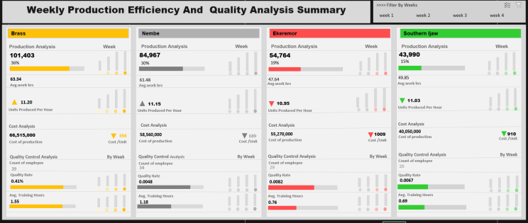
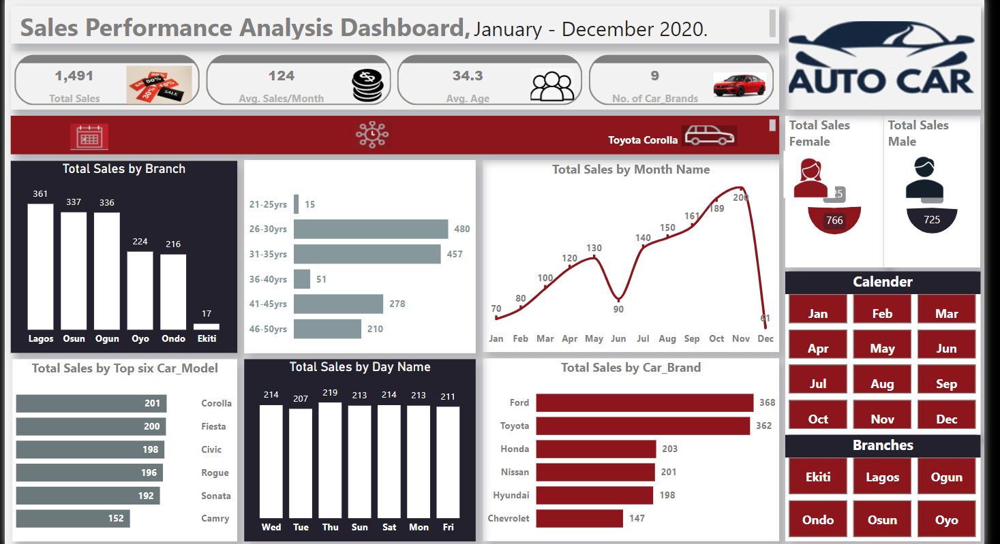

<!--Section 1: Introduce your self-->
## ABOUT ME

Hi, I  am Ibigbemi  Tolani
Data-driven decisions are my forte. As a Data Analyst with expertise in Excel, Power BI, SQL, and Tableau, I help businesses unlock growth through insightful analysis and visualization. My approach combines analytical rigor with a creative flair, ensuring that every dataset tells a compelling story.

## Key Achievements:
30% Increase in Efficiency: Streamlined reporting processes that saved countless hours.

## Data Visualization Mastery: 
Developed engaging dashboards that transformed complex data into clear insights.

## Mentorship Passion: 
Committed to guiding future analysts in navigating the data landscape.

When I’m not diving into data, you can find me window shopping or enjoying the latest blockbuster. 

Let’s connect and explore how we can leverage data to achieve your business goals.

<!--Mention your top/relevant skills here - core and soft skills-->
## WHAT I DO

*You might be wondering, “What exactly does a data analyst do?” Well, let me break it down for you. I specialize in transforming numbers into narratives that drive business growth. With expertise in Excel, Power BI, and SQL, I make it my mission to help organizations harness the power of their data.
*
## My Focus.
**- ✅ Data Analysis:**
 I dive deep into datasets to uncover insights that inform strategic decisions. Whether it’s identifying trends or optimizing processes, I’m here to turn raw data into actionable strategies.
 

**- ✅ Data Visualization:.**
Using tools like Power BI and Tableau, I create engaging dashboards that make complex information accessible and easy to understand. My goal is to present data in a way that even your non-technical colleagues can appreciate (and maybe even enjoy).

**- ✅ Mentoring Future Analysts:.**
 I’m passionate about sharing my knowledge and experience with aspiring data analysts. Whether it’s through one-on-one mentoring or workshops, I love helping others develop their skills and confidence in the world of data.

**- ✅ My Passion:.**
I believe that every dataset has a story to tell, and my job is to help you hear it. Data analysis isn’t just about crunching numbers; it’s about making informed decisions that lead to meaningful outcomes. Let’s connect if you’re interested in unlocking the potential of your data or if you just want to chat about the latest trends in analytics.

<!--Section 2: List 3-4 key projects-->
## Projects

*A glimpse of some of the projects I've been working on.*

**Production Efficiency And Cost Analysis**

Project Title: Production Efficiency and Cost Analysi

Objective:

This analysis aimed to evaluate production efficiency, cost analysis, and quality control metrics for production units over a specified period. The primary Objective was to identify areas for improvement in operational performance and cost management.

[Read More](https://www.linkedin.com/pulse/production-efficiency-cost-analysis-tolani-ibigbemi-9mf0f?utm_source=share&utm_medium=member_android&utm_campaign=share_via)

**Income Statement Analysis.**

Objective:
The primary goal of this project was to analyze the income statement data for the period of 2023-2024. The analysis aimed to identify key finacial trends, assess overall financial performance and provide actionable insights to enhance provitability.

[Read More](https://www.linkedin.com/pulse/income-statement-analysis-2023-2024-tolani-ibigbemi-11r4f)

**Auto Car Sales Analysis.**

**Quick Statistics in Data Analysis**
These statistical measures collectively enable you to summarize and analyze the central tendency, spread, and distribution of data. By incorporating them into your data analysis toolkit, you can gain valuable insights, make informed comparisons, and draw meaningful conclusions tailored to your specific learning objectives.

<a href="https://www.linkedin.com/pulse/quick-statistics-data-analysis-christiana-ibigbemi/">Read the details here</a>

**Gallery**
Training and mentorship session with students

## CONTACT DETAILS

*Let’s connect and see how we can make a difference together!*
<table>
  <tbody>
    <tr>
      <td>📧</td>
      <td><a href="tolicles@gmail.com">tolicles@gmail.com</a></td>
    </tr>
    <tr>
      <td>📞</td>
      <td>(234) 703-438-9097</td>
    </tr>
    <tr>
      <td>📍</td>
      <td>PH, Nigeria</td>
    </tr>
    <tr>
      <td>⬇️</td>
      <td><a href="CHRISTIANAIBIGBEMI Rated (1).pdf">Download my CV</a></td>
    </tr>
    <tr>
      <td>🌐</td>
      <td><a href="https://www.linkedin.com/in/christianaibigbemi">The things I do daily on LinkedIn</a></td>
    </tr>
    <tr>
      <td>📺</td>
      <td><a href="https://www.youtube.com/@DataDuchess">Watch my tutorials on YouTube</a></td>
    </tr>
  </tbody>
</table>

   

